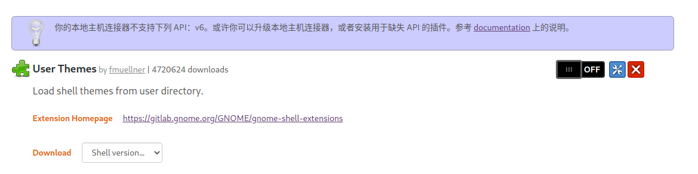

# 系统主题美化


## 初步 Tweaks

```bash
# 获取软件包的最新信息，确保将要安装的软件包是最新版本
sudo apt update
# 安装 gnome-tweaks
sudo apt install gnome-tweaks
```

安装后可以在 Show Applications 里找到，名字是 Tweaks 。它可以增加一些系统里可以自定义的地方，比如：

- 最小化/最大化/关闭按钮左移（仅限使用系统标题栏的应用，像是 Google Chrome 就不受此设定影响）
- 移除桌面上的个人文件夹和废纸篓图标
- 设置系统主题、图标和字体
- 设置开机启动软件
- 自定义顶栏时间显示
- 简单管理 Gnome 插件


## 安装 Gnome 插件


## 安装系统主题

打开浏览器，到 [Gnome-look](https://www.gnome-look.org/) 网站选择自己喜欢的系统主题。

在安装之前，先确定系统有没有满足以下要求：

- GTK 版本 >= 3.20
- 安装了 gnome-themes-extra
- 安装了 gtk2-engines-murrine
- 安装了 sassc

```bash
#　没有或不确定有没有安装的可以在 Terminal 里执行以下命令：
sudo apt install gnome-themes-extra gtk2-engines-murrine sassc
```

# gnome shell

**什么是 GNOME Shell 扩展？**

默认情况下，GNOME Shell 具有一组由开发人员确定的功能。GNOME Shell 扩展是由第三方开发人员编写的一小段软件代码，用于增强或添加 GNOME 桌面的功能。它们为桌面添加了方便的功能，因此可以通过提高生产力使生活更轻松。


shell 无法使用  ---插件GNOME Shell 集成  显示--


安装这个来解决

https://github.com/mjakeman/extension-manager


# dock

设置dock, 在设置--外观--Dock  --屏幕上位置设置为底部

配置dock 行为


安装dash to dock   ---不要用太垃圾了， 一堆问题


# Terminal 美化

　　既然是提升工作环境，那自然少不了美化 Terminal 。

## 更改默认 Shell 至 Zsh

```
# 查看当前使用的 Shell
echo $SHELL 
# 查看系统是否安装了 Zsh
cat /etc/shells
# 安装 Zsh
sudo apt install -y zsh
```

然后安装 Zinit ，接着执行以下命令：

```
# 设置默认 Shell 为 Zsh
chsh -s $(which zsh)
```

# [zsh-autosuggestions](https://github.com/zsh-users/zsh-autosuggestions)

先安装zsh  

```
sudo apt install zsh
```

安装oh-my-zsh

```bash
sh -c "$(curl -fsSL https://raw.github.com/ohmyzsh/ohmyzsh/master/tools/install.sh)"
```


```
sudo usermod -s /usr/bin/zsh $(whoami)
```


## 安装zsh-autosuggestions

```
git clone https://github.com/zsh-users/zsh-autosuggestions ${ZSH_CUSTOM:-~/.oh-my-zsh/custom}/plugins/zsh-autosuggestions
```

```bash
#在~/.zshrc中添加
plugins=( 
    # other plugins...
    zsh-autosuggestions
)
```

WhiteSur-gtk-[theme](https://github.com/vinceliuice/WhiteSur-gtk-theme)

